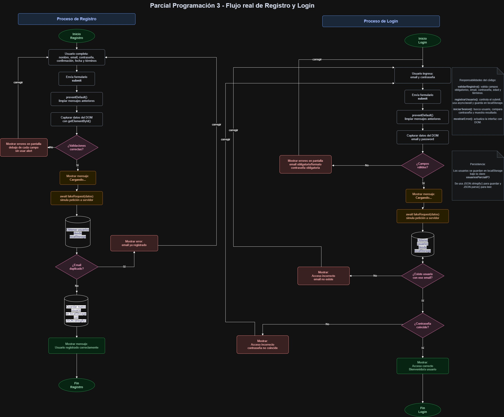

# Parcial P3 - Registro y Login de Usuarios

de La Madrid Carlos.

## Descripción del proyecto

Este proyecto consiste en un módulo frontend de registro y autenticación de usuarios desarrollado con HTML, CSS y JavaScript puro.

El sistema permite registrar usuarios, validar los datos ingresados, almacenar la información en `localStorage` y luego iniciar sesión con email y contraseña.

El trabajo fue realizado sin frameworks, sin backend y sin instalaciones adicionales, cumpliendo con los requerimientos del parcial de Programación 3.

---

## Tecnologías utilizadas

* HTML5
* CSS3
* JavaScript
* localStorage
* Manipulación del DOM
* async/await
* Promesas
* Flexbox

---

## Estructura del proyecto

```text
/parcial-p3
│── index.html
│── styles.css
│── app.js
│── README.md
│── img/
│   └── diagrama-flujo.png
```

---

## Instrucciones para ejecutar el proyecto

1. Descargar o clonar el repositorio.
2. Abrir la carpeta del proyecto.
3. Ejecutar el archivo `index.html`.

El proyecto también puede abrirse desde Visual Studio Code usando la extensión Live Server, aunque no es obligatorio.

No requiere instalación de dependencias ni configuración adicional.

---

## Usuario de prueba

El sistema incluye un usuario de prueba que se crea automáticamente en `localStorage` al cargar la página.

**Email:**

```text
prueba@correo.com
```

**Contraseña:**

```text
Prueba123
```

Este usuario puede utilizarse directamente en el formulario de login.

---

## Funcionalidades implementadas

### Registro de usuario

El formulario de registro permite ingresar:

* Nombre y apellido
* Email
* Contraseña
* Confirmación de contraseña
* Fecha de nacimiento
* Aceptación de términos y condiciones

---

## Validaciones implementadas

Las validaciones se ejecutan al enviar el formulario de registro.

Se valida que:

* Todos los campos sean obligatorios.
* El email tenga un formato válido.
* La contraseña tenga al menos 8 caracteres.
* La contraseña incluya al menos un número.
* La confirmación de contraseña coincida con la contraseña ingresada.
* El usuario sea mayor de 18 años.
* El checkbox de términos y condiciones esté seleccionado.
* No exista otro usuario registrado con el mismo email.

Los mensajes de error se muestran en la interfaz mediante manipulación del DOM, debajo de cada campo correspondiente.

No se utiliza `alert`.

---

## Login de usuario

El formulario de login permite ingresar:

* Email
* Contraseña

El sistema valida:

* Que el email exista en `localStorage`.
* Que la contraseña coincida con la contraseña registrada.

Si los datos son correctos, se muestra un mensaje de acceso correcto.
Si los datos son incorrectos, se informa el error en pantalla.

---

## Uso de localStorage

Los usuarios registrados se almacenan en `localStorage` utilizando la clave:

```javascript
usuariosParcialP3
```

Para guardar los datos se utiliza `JSON.stringify()`, ya que `localStorage` solo permite almacenar texto.

Para recuperar los datos se utiliza `JSON.parse()`, convirtiendo el texto guardado nuevamente en un arreglo de objetos.

---

## Uso de asincronía

El proyecto simula una petición a servidor mediante la función `fakeRequest`.

```javascript
function fakeRequest(data) {
    return new Promise((resolve) => {
        setTimeout(() => resolve(data), 1000);
    });
}
```

Esta función se utiliza dentro de los procesos de registro y login usando `async/await`.

Mientras se espera la respuesta simulada, se muestra el mensaje:

```text
Cargando...
```

Esto permite representar el comportamiento de una petición real a un servidor.

---

## Manipulación del DOM

El proyecto utiliza manipulación del DOM para:

* Capturar formularios.
* Leer valores ingresados por el usuario.
* Mostrar errores debajo de los campos.
* Mostrar mensajes de éxito o error.
* Cambiar clases CSS dinámicamente.
* Evitar la recarga de la página.

También se utiliza:

```javascript
addEventListener()
```

Para escuchar los eventos de envío de formularios.

Y:

```javascript
preventDefault()
```

Para evitar que la página se recargue al enviar los formularios.

---

## Flujo del proceso

El siguiente diagrama representa el flujo general del registro y del login implementado en el código.



---

## Flujo de registro

1. El usuario completa el formulario de registro.
2. Presiona el botón "Registrarse".
3. Se ejecuta `preventDefault()` para evitar la recarga de la página.
4. Se limpian los mensajes anteriores.
5. Se capturan los datos ingresados.
6. Se validan los campos.
7. Si hay errores, se muestran en pantalla.
8. Si los datos son válidos, se muestra "Cargando...".
9. Se ejecuta la petición simulada con `fakeRequest` usando `async/await`.
10. Se verifica si el email ya existe en `localStorage`.
11. Si el email está duplicado, se muestra un mensaje de error.
12. Si el email no existe, se guarda el nuevo usuario en `localStorage`.
13. Se muestra un mensaje de registro exitoso.

---

## Flujo de login

1. El usuario ingresa email y contraseña.
2. Presiona el botón "Iniciar sesión".
3. Se ejecuta `preventDefault()` para evitar la recarga de la página.
4. Se limpian los mensajes anteriores.
5. Se capturan los datos ingresados.
6. Se validan los campos obligatorios.
7. Si hay errores, se muestran en pantalla.
8. Si los datos son válidos, se muestra "Cargando...".
9. Se ejecuta la petición simulada con `fakeRequest` usando `async/await`.
10. Se buscan los usuarios guardados en `localStorage`.
11. Se verifica si existe un usuario con ese email.
12. Se compara la contraseña ingresada con la contraseña guardada.
13. Si los datos coinciden, se muestra acceso correcto.
14. Si no coinciden, se muestra acceso incorrecto.

---

## Funciones principales del código

### `fakeRequest(data)`

Simula una petición a servidor mediante una promesa que responde después de un segundo.

### `obtenerUsuarios()`

Obtiene los usuarios guardados en `localStorage`.
Si no hay usuarios, devuelve un arreglo vacío.

### `guardarUsuarios(usuarios)`

Guarda el arreglo de usuarios en `localStorage`.

### `mostrarError(idElemento, mensaje)`

Muestra un mensaje de error dentro de un elemento del HTML.

### `limpiarErroresRegistro()`

Limpia los errores y mensajes del formulario de registro.

### `limpiarErroresLogin()`

Limpia los errores y mensajes del formulario de login.

### `emailValido(email)`

Verifica que el email tenga un formato válido mediante una expresión regular.

### `esMayorDeEdad(fechaNacimiento)`

Calcula la edad del usuario a partir de su fecha de nacimiento y valida que sea mayor o igual a 18 años.

### `validarRegistro(datos)`

Valida todos los campos del formulario de registro.

### `validarLogin(datos)`

Valida los campos básicos del formulario de login.

### `registrarUsuario(evento)`

Controla todo el proceso de registro, incluyendo validaciones, asincronía, verificación de email duplicado y almacenamiento en `localStorage`.

### `iniciarSesion(evento)`

Controla todo el proceso de login, incluyendo validaciones, asincronía, búsqueda del usuario y comparación de contraseña.

### `crearUsuarioDePrueba()`

Crea automáticamente un usuario de prueba en `localStorage` si todavía no existe.

---

## Condiciones técnicas cumplidas

* El proyecto se ejecuta abriendo el archivo `index.html`.
* No requiere instalación adicional.
* No utiliza frameworks.
* No utiliza backend.
* No utiliza `alert`.
* No recarga la página al enviar formularios.
* Usa `addEventListener`.
* Usa `preventDefault`.
* Usa `localStorage`.
* Usa `async/await`.
* Usa una función simulada de petición a servidor.
* El código está organizado en archivos separados.
* El sistema se encuentra funcional.


